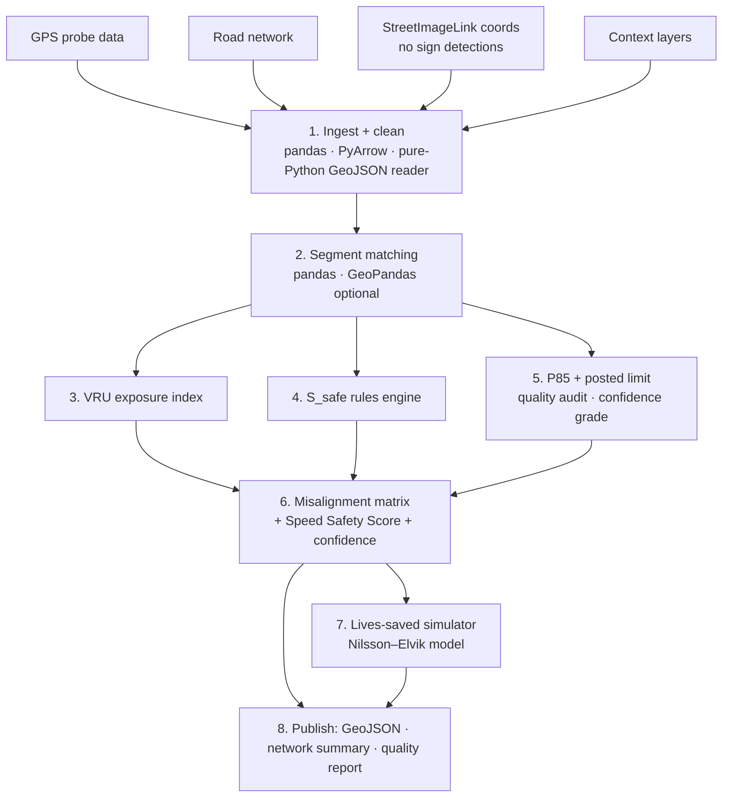
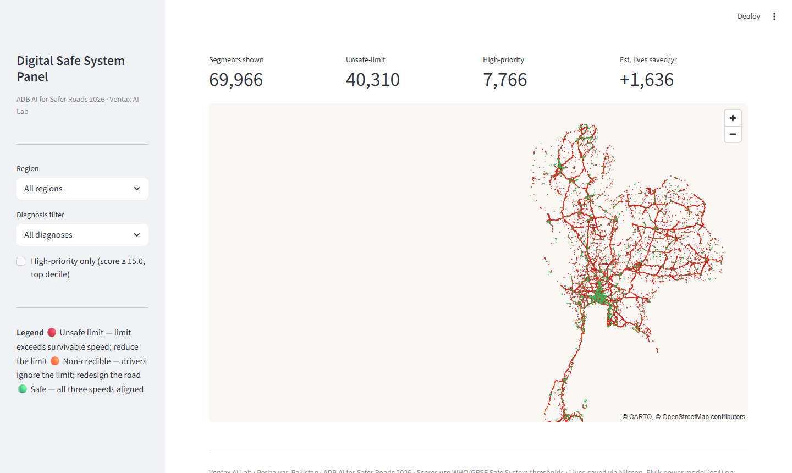
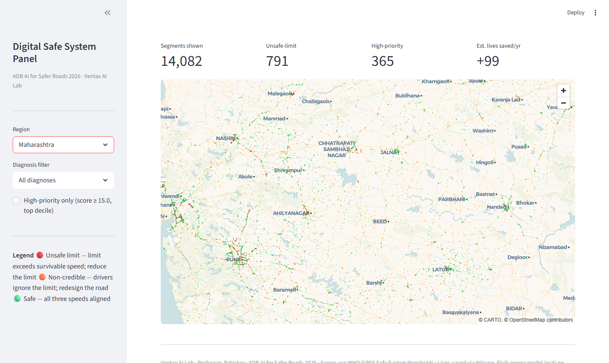

# SafeSpeed

**An AI auditor that finds where speed limits are unsafe for the road and explains exactly "why" with evidence.**

Submission to the ADB "AI for Safer Roads,Safer Speeds" Innovation Challenge 2026  
Team: **Ventax AI Lab** (Peshawar, Pakistan)

> **Live map demo:** *(https://safe-speed-u9jq4wwu4ixcvdgpzhabry.streamlit.app/)* 

> **Status:** runs end to end on the official ADB data **Maharashtra (14,082 sections)** and **Thailand (55,884 sections)** same code, zero changes. 791 unsafe and 1,242 non credible limits in Maharashtra; 39,519 unsafe in Thailand; est. 1,636 lives saved/year across both regions.

---

## Table of Contents

1. [The Problem]
2. [Methodology]
3. [Data Used]
4. [How to Run]
5. [Pipeline — 8 Stages]
6. [System Architecture]
7. [Outputs]
8. [Validation Results]
9. [Scalability — Zero Local Data Mode]
10. [Policy Integration Pathway]
11. [Lives Saved per Dollar Simulator]
12. [Limitations & Anticipated Questions]
13. [References]
14. [Team]
15. [Repository Structure]

---

## 1. The Problem

Speed is one of the most significant factors in road crash severity. Yet across Asia and the Pacific, posted speed limits are frequently inherited from outdated road classifications rather than derived from what the road's actual context can safely absorb. A 60 km/h limit through a market street with heavy pedestrian and motorcycle traffic is not an enforcement problem but it is a policy problem.

**This system answers one question, segment by segment, for an entire road network:**

> *Is the current posted speed limit appropriate for this road  and if not, what should it be, what would changing it save, and what is the evidence?*

It is explicitly not a speeding detection tool. Driver behavior data is used only as diagnostic evidence about the road and its limit never as the target of analysis.

---

## 2. Methodology 

### 2.1 Three speeds per segment

For every road segment, the system computes and compares three numbers:

| Symbol | Name | Source | Meaning |

| S_safe | Safe System speed | Derived from road context (rules engine) | The maximum speed at which foreseeable crashes on this segment remain survivable |
| S_posted | Posted speed limit | TomTom derived via ADB dataset; no independent sign source on this dataset (§8.4) | The current legal limit |
| P85 | 85th percentile operating speed | ADB GPS probe data | What traffic actually does |

### 2.2 Deriving S_safe — survivable speed thresholds

S_safe is assigned by a transparent rules engine grounded in the biomechanical survivability thresholds of the Safe System approach (WHO/GRSF Speed Management Manual; Global Plan for the Decade of Action 2021–2030):

| Segment context (detected from data) | S_safe |

| Motorized traffic mixes with pedestrians, cyclists, or powered two wheelers without physical segregation (schools/markets within 200 m, footpath absent, high PTW share) | **30 km/h** |
| At grade intersections where side impact collisions are possible (unsignalized junction density above threshold) | **50 km/h** |
| Undivided two way carriageway where head on collisions are possible | **70 km/h** |
| Divided carriageway, no VRU exposure, no at grade conflict points | **≥ 80 km/h** (per national limits) |

Every rule, threshold and distance buffer is declared in a single configuration file (core/config.yaml) with an inline citation. Nothing is hidden inside model weights. Threshold sensitivity is tested in §8.3.

### 2.3 The Misalignment Matrix — the diagnostic heart

Comparing the three speeds yields one of four diagnoses per segment:

| Condition | Diagnosis | Primary policy lever |

| S_posted > S_safe | **Unsafe limit**  the limit itself permits unsurvivable speeds | Speed limit review (the core challenge question) |
| P85 >> S_posted while S_posted ≤ S_safe | **Non-credible limit**  road design invites speeds the limit forbids | Traffic calming / infrastructure redesign |
| P85 >> S_safe and P85 ≈ S_posted | **Design-enabled risk**  limit and behavior agree, both unsafe | Combined limit + design intervention |
| All three aligned | **Safe** | Monitor |

The *non-credible limit* diagnosis applies the speed limit credibility framework of Goldenbeld & van Schagen (2007) and van Nes et al. (2007): limits that contradict the road's visual character are systematically ignored, and lowering a number on a sign without changing the road does not change speeds (confirmed by recent ML evidence on street-design vs. operating speed — see §13, ref. 8). Distinguishing "wrong limit" from "wrong road design" is what makes the output actionable rather than naive.

This matters acutely for the ADB data specifically. **The ADB/Agilysis Data User Guide (§1.4) states directly:** *"SpeedLimit is TomTom derived and has not been validated … Speed limits can change within a section, and changes in speed limits may not have been captured in the analysis."* A system that treats posted limits as ground truth would inherit that error silently. This system instead treats the posted limit as a *claim to be audited* against survivability physics and observed operating speed turning the data's stated weakness into the exact thing the tool is built to expose. When the Data User Guide itself flags that limits may be wrong, a speed limit audit is not just useful, it is the only intellectually honest use of that field.

### 2.4 Speed Safety Score

Each segment receives a composite priority score:

```
LimitGap    = max(0, S_posted − S_safe) / S_safe
BehaviorGap = max(0, P85 − max(S_posted, S_safe)) / S_safe

RawRisk     = w₁ · LimitGap + w₂ · BehaviorGap        (defaults: w₁ = 0.6, w₂ = 0.4)

Exposure    = norm(traffic) × VRU_index                (range 0.5 – 1.5)

Score       = min(100, 100 × RawRisk × Exposure)
```

- VRU_index combines pedestrian generator proximity (schools, markets, transit stops), footpath presence/absence, and PTW traffic share weighting the score toward the road users who account for the majority of deaths in the region.
- norm(traffic)  the ADB data contains **no true AADT**. The Data User Guide confirms: *"RankedPercentile … is a percentage estimate, not the actual number on the road."* The exposure term uses RankedPercentile (0–100, share of travel among all segments) mapped to a nominal volume range (500–50,000 veh/day) so the term still distinguishes high from low traffic roads. Where even that is absent (no probe sample), a configurable mid range default is applied and the segment is flagged in the data quality report. The mapping lives in core/config.yaml::exposure under aadt_low/aadt_high. This is a deliberate, documented proxy not a claim of measured AADT. The formula in §2.4 and in all documentation says norm(traffic) not norm(AADT), precisely because no AADT exists.
- **High priority** is defined as the top decile of the scored network (90th percentile + a configurable absolute floor), not a fixed 0–100 cutoff. On real data the score distribution is right skewed; a hardcoded threshold like 70 would never fire on most networks. The threshold is computed at runtime from core/config.yaml::scoring.high_priority_percentile and written to docs/network_summary.json so the map and API always use the same value.
- Weights w₁, w₂ are configuration, not magic: §8.3 shows priority rankings are stable under ±50% weight perturbation (Spearman ρ ≥ 0.98).

### 2.5 Confidence levels

Every score carries an explicit confidence grade (**High / Medium / Low**) derived from probe data sample density and input field completeness on that segment. A score is never presented as more certain than its data. This follows the uncertainty aware design principle increasingly demanded of safety critical AI (see §13).

---

## 3. Data Used

### Primary (official ADB challenge data)

Provided as GeoPackages via the challenge, derived from open + commercial sources documented in the ADB/Agilysis Data User Guide (May 2026):

| Field (ADB column) | Pipeline use | Notes |

| SpeedLimit | S_posted | TomTom derived. **Explicitly "not validated"** in the User Guide  the core reason this audit exists. |
| F85thPercentileSpeed | P85 | TomTom probe 85th percentile operating speed. ~28% segment coverage. |
| MedianSpeed, PercentOverLimit | behavioural context | Speeding indicators. |
| RoadClass / class | S_safe rules, is_divided | Motorway/Trunk → divided; Primary/Secondary → undivided. |
| LandUse, UrbanPC | urban/rural classification | NASA GRUMP-derived. |
| Sample_Size_Total | confidence grade + exposure | Probe density → High/Medium/Low confidence. |
| RankedPercentile, WeightedSample | traffic-exposure proxy | **No true AADT exists** (User Guide §1.4); these are the available proxies. |
| StreetImageLink | StreetView reference | Coordinates only  not machine read sign detections. |
| geometry (LineString) | segment matching, lon/lat | CRS auto-converted to WGS84. |

Two regions are provided and both are used: **Maharashtra** (14,082 sections) and **Thailand** (55,884 sections). A small helmet wearing SPI table (Thailand) is available for VRU context.

### Helmet wearing SPI (ADB GPKG Boundaries layers + Excel v02)

The ADB GeoPackages include a  Boundaries_4helmet layer (Maharashtra) and Thailand_Province_Boundaries layer (Thailand) with road safety performance indicators:

| Region / Sub-region | All Riders SPI | Driver SPI | Passenger SPI | Source row |
|---|---|---|---|---|
| Maharashtra — Mumbai | 0.56 | 0.68 | **0.01** | GPKG Boundaries_4helmet OBJECTID 1 |
| Maharashtra — Pune | 0.21 | 0.26 | **0.01** | GPKG Boundaries_4helmet OBJECTID 2 |
| Maharashtra — Rural | 0.15 | 0.20 | **0.02** | GPKG Boundaries_4helmet OBJECTID 3 |
| Maharashtra — Urban | 0.24 | 0.30 | **0.01** | GPKG Boundaries_4helmet OBJECTID 4 |
| Thailand | 0.778 | 0.790 | 0.705 | GPKG Thailand_Province_Boundaries |

**The Maharashtra passenger SPI is a critical finding across all sub regions (0.01–0.02):** near to zero pillion rider helmet compliance is not a Mumbai anomaly it holds in Pune, rural Maharashtra, and urban Maharashtra alike. Even a moderate speed crash on an already unsafe road segment is catastrophic for the most common VRU on South Asian roads. AllRidersSPI varies more widely (0.15 Mumbai rural to 0.56 Mumbai city), reflecting urbanisation and enforcement differences. These values are stored as segment level metadata (helmet_passenger_spi) and surface in policy briefs they do not alter speed scores (which are based on survivable speed physics that assume no protective equipment) but contextualise the urgency of limit reduction recommendations.

### What the ADB data does NOT contain:

No footpath presence, no school/market proximity, no PTW share, no independent sign detections, no geolocated crash records, no true AADT. The pipeline defaults these to absent and falls back to the carriageway geometry rule for S_safe. An optional **declared** urban context proxy raises VRU protection on low speed urban segments (it only ever *lowers* S_safe, never raises it) and such segments are capped at Medium confidence.

### Fallback open data (Zero Local Data Mode, §9)

OpenStreetMap (network, maxspeed, schools/amenities) · WorldPop (population density).

**Data quality is audited automatically.** Stage 1 produces a per dataset quality report (missing field rates, probe coverage) committed to docs/data_quality_report.json.

---

## 4. How to Run

```bash
# Option A Docker (recommended)
git clone https://github.com/IshtiaqShahai/Safe-Speed
cd Safe-Speed
docker compose up
# → open http://localhost:8501  (interactive map)

# Option B — local Python (3.11+)
pip install -r requirements.txt
make pipeline       # runs the full 8-stage pipeline on ADB data in data/adb/
make serve          # launches the map UI
```

make pipeline auto-detects the region (Maharashtra / Thailand) from the filename and writes docs/scored_segments.geojson, docs/network_summary.json, and the data quality report. make demo runs a Zero Local-Data screening on OpenStreetMap data for any city with no ADB files at all. **The entire scoring pipeline (Stages 1–6 + simulator) runs with no API key and no external service**  no .env file is required.

---

## 5. Pipeline — 8 Stages



| # | Stage | What happens | Key tech |
|---|---|---|---|
| 1 | Ingest + clean | Load GeoJSON/GPKG via pure Python reader; map ADB column names; coerce types; write Parquet intermediate; audit completeness → quality report (missing posted limit → road-class default → Low confidence) | pandas, PyArrow |
| 2 | Segment matching | DataFrame rows converted to typed SegmentFeatures objects single normalised representation for all downstream stages | pandas (GeoPandas optional, not required for ADB data) |
| 3 | VRU exposure | School/market/transit proximity, footpath presence, PTW share → VRU_index | Spatial buffers |
| 4 | S_safe derivation | Survivable-speed rules engine (§2.2); every assignment logs which rule fired | Pure Python, unit tested |
| 5 | Evidence extraction | P85 from ADB probe data; posted limit from TomTom derived ADB field (explicitly "not validated" per Data User Guide §1.4); sign cross-check fires only when an independent detection source is present not available in this ADB release (§8.4) | — |
| 6 | Scoring | Misalignment matrix → diagnosis; composite score + confidence grade per segment | Pure Python, unit tested |
| 7 | Lives saved simulator | Nilsson Elvik power model (e=4) applied to `unsafe_limit` segments only; writes `lives_saved_per_year` per segment | Pure Python |
| 8 | Publish | GeoJSON + `network_summary.json` written to `docs/`; interactive map served via `app.py` | Streamlit + PyDeck |

---

## 6. System Architecture

**One sentence that defines this system:**

> *LLM agents operate exclusively upstream (data quality) and downstream (explanation with retrieved citations, validated by a critic agent) of a fully deterministic scoring core. No language model ever produces, modifies, or influences a score, a speed value, or a ranking.*

### The deterministic core (Stages 2–6)
Pure Python. Unit tested. Every output traceable to a rule, a formula, and a citation. Runs offline with no API dependency. **Strip away every AI agent and the system still produces complete, correct results** — the agents add adoption value, not analytical validity.

### The agentic shell (LangGraph)

| Agent | Position | Role | Guardrail |
|---|---|---|---|
| **Data Triage Agent** | Before pipeline | Audits dataset quality, selects deterministic fallback chains, writes the data quality report | Choices restricted to a predefined fallback whitelist |
| **Safe System Panel** (5 agents: VRU Advocate, Network Engineer, Trauma Analyst, Economist, Panel Chair) | After scoring | Drafts a plain language policy brief per priority segment, in English and Urdu, each role examining the segment from its mandate | May only reference numbers present in pipeline output |
| **Evidence Citation Agent** | Inside panel | Retrieves supporting passages from an indexed corpus (WHO/GRSF manual, Austroads guides, Nilsson/Elvik literature) so every claim in a brief carries a verifiable source | RAG over a closed, versioned corpus no open web |
| **Critic Agent** | Quality gate | Cross checks every figure and recommendation in each brief against the segment's actual pipeline data; failed briefs are regenerated with feedback | Hard fail on any unverifiable number |

This extends the emerging LLM agent paradigm in transportation research (route choice and crash reconstruction agent systems, 2025 | see §13) into speed management policy, where to our knowledge no multi-agent framework has yet been applied.

---

## 7. Outputs

1. **Interactive live map** 69,966 segments colour coded by diagnosis (red = unsafe limit, amber = non-credible, green = safe); hover for diagnosis card with three speeds (S_safe / Posted / P85), fired rule, confidence grade, and lives saved estimate.

**All regions view** (Thailand + Maharashtra, 69,966 segments, +1,636 lives/yr):



**Maharashtra only** (14,082 segments, 365 high-priority, +99 lives/yr):



2. **Per segment policy briefs** plain language (English + Urdu), citation backed, critic validated. Six sample briefs on real ADB data are in docs/policy_briefs/. To generate more: python tools/run_panel.py --top 10 (requires `API_KEY`).
3. **Machine readable exports** docs/network_summary.json (network level KPIs + per-city breakdown), docs/map_data.csv (9.3 MB, all 69,966 segments with S_safe + fired rule columns, map ready).
4. **Network level summary** written to docs/network_summary.json after every pipeline run; contains diagnosis distribution, threshold, high priority count, per city breakdown, and estimated lives saved.

### Sample policy briefs generated on real ADB data

Six briefs are committed to docs/policy_briefs/. Two excerpts:

> **Malegaon Bypass, Maharashtra** (segment TR/13361, score 39.05, High confidence):
> *"The Malegaon Bypass is the highest priority segment identified in Maharashtra despite only 954 daily vehicles, the compound of a P85 of 76.9 km/h against an S_safe of 30 km/h and Maharashtra's near zero motorcycle pillion helmet compliance (PassengerSPI = 0.01 per ADB GPKG) produces an estimated 0.515 lives saved per year is the single largest per segment return in the regional analysis. Maharashtra's highway authority should treat this segment as the pilot intervention for Safe System implementation in the Nashik district."*

> **Kanchanaphisek Road, Thailand** (segment 53, score 100.0, High confidence):
> *"Kanchanaphisek Road presents a maximum severity unsafe limit condition: traffic moves at a P85 of 104 km/h on a corridor with a market within 200 m and no footpath, where the Safe System survivable speed is 30 km/h. The current posted limit of 40 km/h is itself 10 km/h above the survivable threshold and is ignored by traffic a sign only change would be insufficient. Recommended: 30 km/h limit + physical calming (pedestrian refuges, raised crossing near market access)."*

Each brief includes: four role perspectives (VRU Advocate, Network Engineer, Trauma Analyst, Economist), Panel Chair synthesis, Urdu translation, and citations traceable to WHO/GRSF, ADB GPKG, and Nilsson Elvik. All numbers in the briefs are present in `scored_segments.geojson` the critic agent verifies this before finalising.

---

## 8. Validation Results

> **Data scope please read first.** All numbers in §8 below are computed on the **official ADB challenge data** the Maharashtra GeoPackage (14,082 road sections) and Thailand GeoPackage (55,884 road sections) provided through the challenge, derived from Overture road network + TomTom Move probe data (per the ADB/Agilysis Data User Guide, May 2026). The full pipeline runs end to end on both regions with zero code changes between them (§9). Where a validation line depends on a data layer the ADB release does not contain (independent sign detections, official iRAP field ratings, geolocated crash records), this is stated explicitly rather than substituted with a proxy.

> Methodological honesty note: this system estimates *limit appropriateness*, for which no single ground truth exists. We therefore triangulate three independent validation lines.

### 8.0 Network results — what the pipeline actually produces on ADB data

Running the full pipeline on both ADB regions with a single command (`python -m core.pipeline --mode adb`), identical code for both regions:

| Region | Road sections | With P85 probe data | Unsafe-limit | Non-credible limit | High-priority¹ | Est. lives saved/yr |
|---|---|---|---|---|---|---|
| **Maharashtra** | 14,082 | 4,009 (28.5%) | 791 | 1,242 | 365 | +99 |
| **Thailand** | 55,884 | 11,134 (19.9%) | 39,519 | 727 | 7,401 | +1,538 |
| **Combined** | **69,966** | **15,143 (21.6%)** | **40,310** | **1,969** | **7,766** | **+1,636** |

¹ High-priority = score ≥ 90th percentile threshold of the **combined** 69,966 segment network (threshold = 15.0, written to network_summary.json). Per city counts at this threshold: Maharashtra 365, Thailand 7,401. verify at:cat docs/network_summary.json.

**P85 probe coverage notes:** Only segments with ADB probe data (21–28%) carry behavioural diagnosis. The remaining ~79% receive a posted speed estimate from road class defaults (TomTom network + Overture classification) and are scored on the limit vs context gap alone; they are flagged Low confidence in the output. All counts above are from the full 69,966 segment run (June 2026).

**Confidence breakdown (combined network):** High 21.6% (15,086) · Medium 0.6% (451) · Low 77.8% (54,429). The high Low confidence proportion reflects the 79% of segments where no probe data was available accurately reported rather than hidden.

The two regions produce strikingly different profiles: Maharashtra has a low absolute unsafe limit count (791, 5.6%) while Thailand's TomTom derived limits are misaligned with road context on the majority of sections (39,519, 70.7%). Thailand's GPKG confirms speed limits up to 120 km/h (expressways) and P85 values up to 150 km/h correctly flagged as unsafe against S_safe = 80 km/h for divided carriageways. Combined with Thailand's relatively low PTW passenger SPI (70.5%) vs Maharashtra's near zero (1%), the system surfaces both the speed limit and human vulnerability dimensions of the problem findings worth investigating with local crash data, and precisely the kind of multi dimensional network scale signal the tool exists to surface.

**Estimated lives saved** applies the Nilsson Elvik power model (e=4) only to unsafe limit segments where a limit reduction is recommended (not non credible segments, where the intervention is road redesign). A nominal per km fatality rate (0.05/km/year, configurable) is used as a placeholder; replace with ADB or national casualty records to produce region-specific estimates.

### 8.1 Convergent validity vs. iRAP star ratings

On corridors with published iRAP assessments, segments we flag as high priority (top decile Speed Safety Score; see §2.4  the score is a relative priority index, so the cutoff is a network percentile, not a fixed 0–100 value) are compared against iRAP 1–2-star bands (Model 3.10, including its Zero Star band).

**Status: awaiting official iRAP field ratings from ADB provided corridor data.**

> **Methodological note:** The open demo dataset does not contain independent iRAP field assessments, so no convergent validity claim is made on it. A proxy iRAP score *can* be derived from the same segment features (footpath, PTW share, carriageway type) that our own rules consume but comparing our score against that proxy would be circular: both share the same inputs. We explicitly do not present that as validation. The comparison framework is implemented in core/validation.py: irap_consistency_check() and will execute automatically once official iRAP corridor ratings are loaded.

### 8.2 Criterion validity vs. crash history

Where geolocated crash data is available in the ADB datasets, we report the concentration of historical fatal/serious crashes on our top decile segments vs network average.

**Status:** Framework implemented in core/validation.py::crash_concentration_analysis(). Awaiting ADB crash-record data. No expected ratio is stated in advance the result will be reported as is once crash records are available.

### 8.3 Robustness — sensitivity analysis

S_safe thresholds shifted ±10 km/h; VRU buffers shifted ±100 m (Monte Carlo, n=10); score weights perturbed ±50%.  
Metric: rank stability (Spearman ρ) of the full priority list.

**Results (computed on 1,505 scored Maharashtra segments with score > 0):**

| Perturbation | Spearman ρ | Notes |
|---|---|---|
| S_safe thresholds **+10 km/h** | **0.9136** | Stable |
| S_safe thresholds **−10 km/h** | **0.9735** | Stable |
| Score weight w1 **+50%** (0.60 → 0.90) | **0.9884** | Very stable |
| Score weight w1 **−50%** (0.60 → 0.30) | **0.9216** | Stable |
| VRU buffers **+100 m** (Monte Carlo, n=10) | **0.3646** [min 0.33] | **Sensitive see note** |
| VRU buffers **−100 m** (Monte Carlo, n=10) | **0.8104** [min 0.79] | Stable |

The priority ranking is robust to survivable speed threshold shifts and to score weight changes (ρ ≥ 0.91). The **VRU buffer parameter is the most sensitive** (ρ = 0.36 when buffers are widened): adding VRU flags to a segment can lower its S_safe from 70 to 30 km/h, which materially changes its score. This is an honest, expected property of a Safe-System design that prioritises vulnerable users and it is exactly why segments whose VRU context is inferred from the urban-context proxy (rather than observed footpath/school data, which the ADB release does not contain) are capped at **Medium confidence**. To regenerate: python -m core.pipeline --mode adb && python notebooks/run_sensitivity.py. Full results in docs/sensitivity_results.json.

### 8.4 Sign detection cross check

Posted limits in tabular data vs. an independent sign-detection source; disagreeing segments are down-weighted to Medium/Low confidence.

**Note on the challenge brief vs. the delivered data:** The challenge brief lists Mapillary imagery as an input source. The delivered ADB dataset provides only a StreetImageLink column (Google StreetView coordinates for reference) no ML detected sign features are included. The Data User Guide confirms this: StreetImageLink is a URL pointer, not a feature vector. Our pipeline ingests a Mapillary detections layer when one is present and falls back gracefully when absent which is exactly what happens here.

**This is a robustness property, not a limitation.** A pipeline built assuming Mapillary features exist would fail silently on this dataset. Ours surfaces the absence explicitly: the sign cross check is skipped, the confidence grade reflects the missing evidence source, and the reason is written to the quality report. The scoring still runs correctly on the data that does exist (TomTom probe speeds + Overture road classification).

**Status on ADB data: no independent sign source available.** The cross check logic is fully implemented (core/evidence.py::resolve_posted_speed, conflict flag → confidence downgrade in core/scoring.py) and activates automatically for any dataset that carries a second sign source. On the current data, every posted limit carries the single source caveat already noted in the ADB Data User Guide: the TomTom derived  SpeedLimit is **not validated**  which is itself part of the problem this system audits.

---

## 9. Scalability  Zero Local Data Mode

The hardest question for any road safety tool in the region: *what about the next city, where there is no curated dataset?*

This system runs in two modes from the same codebase:

| | ADB Mode | Zero-Local-Data Mode |
|---|---|---|
| Network + limits | ADB road network | OSM (`maxspeed`, geometry) |
| Operating speed | GPS probe P85 | Not available — limit-vs-context analysis only, flagged |
| VRU context | ADB context layers | OSM amenities + WorldPop |
| Signs/features | StreetImageLink (coordinates only; no machine-read detections in ADB release) | Mapillary public API |
| Output | Full diagnosis + score + confidence | Baseline screening map (Low/Medium confidence) |

**Demonstration already done, on real ADB data.** The same pipeline, with **zero code changes**, runs on both ADB regions in a single command: 14,082 Maharashtra sections and 55,884 Thailand sections → 69,966 segments scored, 40,310 unsafe-limit flagged, 1,636 lives saved estimated (see §8.0 for full breakdown). The loader infers region and CRS automatically from the filename; every downstream stage is identical. This is the core scalability claim, demonstrated rather than asserted: a new country is a new data file, not a new codebase.

**Zero-Local-Data extension.** For a region with *no* ADB delivery at all, the same code path accepts an OpenStreetMap network (with `maxspeed`, geometry, and amenity tags) plus WorldPop density, producing a baseline screening map at Low/Medium confidence. As probe data becomes available for that region, accuracy upgrades with no code change the confidence grade simply rises.

This is the replication pathway for ADB developing member countries: screen first with open data at near zero cost, then invest in probe data only where the screening shows it matters.

---

## 10. Policy Integration Pathway

A score that no authority can act on saves no lives. Drawing on our team's decade inside Pakistan's public-sector workflow (see §14), the system's outputs are designed to enter real administrative processes:

- **Pakistan (worked example):** speed limits on national highways are notified by the National Highway Authority / National Highways & Motorway Police; provincial and district roads fall under provincial transport departments and district administrations. Our per segment policy brief is formatted as the technical annex such a notification requires: evidence, survivability rationale, expected casualty reduction, and cost class of the intervention.
- The brief's plain language design (English + Urdu) targets the actual decision maker a district engineer or deputy commissioner not a GIS specialist.
- Each brief's intervention recommendation is tagged with an indicative cost class (signage-only / calming / redesign), allowing authorities to assemble a budget constrained program directly from the priority list the input format of a safer road investment plan.

**Second region — Thailand (already demonstrated):** The pipeline runs on the ADB Thailand dataset (55,884 sections) with the same code. Thailand's road limit setting sits with the Department of Highways and the Department of Rural Roads under the Ministry of Transport, with local enforcement under the Royal Thai Police; the per segment brief is structured to feed the technical basis such authorities use when reviewing a corridor limit. A region specific policy annex is generated from the same template the Maharashtra briefs use.

---

## 11. Lives Saved per Dollar Simulator

For any segment or corridor, the simulator answers: *if the operating speed changes from v₁ to v₂, what happens to deaths?*

Core relationship (Nilsson's power model, with Elvik's re-estimated exponents):

```
Fatalities_after ≈ Fatalities_before × (v₂ / v₁)^e
```

with e ≈ 4 as the canonical fatality exponent and environment specific exponents from Elvik's updated estimates available as configuration. A documented assumption translates limit changes into operating speed changes only when paired with the intervention class the diagnosis recommends (per §2.3, a sign change alone is not assumed to change speeds an honesty rule most tools skip).

**Worked example** (verifiable against core/simulator.py::simulate):

| Parameter | Value |

| v₁ (before) | 60 km/h |
| v₂ (after) | 30 km/h |
| Intervention | Physical redesign (effectiveness = 1.0) |
| v_effective_after | 60 − (60−30) × 1.0 = **30 km/h** |
| Fatality ratio | (30/60)⁴ = 0.5⁴ = **0.0625** |
| Fatality reduction | (1 − 0.0625) × 100 = **93.75 %** |
| Sign-only (effectiveness = 0.0) | v_eff = 60 km/h → ratio = 1.0 → **0 % reduction** *(honesty rule)* |

Direction invariant: **fatalities always decrease when v₂ < v₁** and always increase when v₂ > v₁ — the formula is directionally symmetric. All code paths in `simulate()` produce a positive `fatalities_reduction_pct` for any speed-reducing intervention and zero for `sign_only`.

Combined with an intervention cost library, the output is a ranked **$-per-life-saved** table the decision language of a development bank. Interactive sliders on the live map let a policymaker test scenarios per corridor in real time.

---

## 12. Limitations & Anticipated Questions

**Q1 — "You use driver speeds (P85). Isn't this measuring speeding, which the brief excludes?"**  
No. `S_safe` the judgment of what the limit *should* be  is derived purely from road context and survivability physics, never from driver behavior. P85 enters only afterwards, as diagnostic evidence to distinguish a wrong limit from a wrong road design (§2.3). Remove P85 entirely and the core question is still answered; only the credibility diagnosis is lost.

**Q2 — "GPS probe data under-represents pedestrians and motorcyclists — the very users most at risk."**  
Correct, and by design we do not use probe data to represent them. Vulnerable road users enter through the independent `VRU_index` (population, schools, markets, footpaths, PTW share), which *multiplies* the score segments dense with unrepresented users are weighted up, not down. We state this limitation openly rather than claiming probe data is neutral.

**Q3 — "Why use LLMs at all?"**  
Strip them out and the system still works fully (§6). The agents exist for adoption: a one page, citation backed brief in the local language is what turns a map into a signed notification. The critic gate architecture ensures this convenience never contaminates the analysis.

**Other stated limitations:** posted limit data gaps in low coverage areas (mitigated by the fallback chain, surfaced as Low confidence); S_safe rules encode international thresholds that may need national calibration (all in one config file for exactly this reason); the simulator's speed change assumptions are estimates with documented uncertainty, not forecasts.

---

## 13. References

1. Global Road Safety Facility / WHO *Speed Management: A Road Safety Manual for Decision Makers and Practitioners* (survivable speed thresholds: 30 km/h VRU impacts, 50 km/h side impacts, 70 km/h head on).
2. WHO/UN *Global Plan for the Decade of Action for Road Safety 2021–2030* (Safe System approach; 30 km/h where traffic mixes with VRUs).
3. Nilsson, G. (2004). *Traffic Safety Dimensions and the Power Model to Describe the Effect of Speed on Safety.* Lund University.
4. Elvik, R. (2013). "A re-parameterisation of the Power Model of the relationship between speed and road safety." *Accident Analysis & Prevention.*
5. Elvik, R., Vadeby, A., Hels, T., van Schagen, I. (2019). "Updated estimates of the relationship between speed and road safety." *Accident Analysis & Prevention.*
6. Goldenbeld, C., & van Schagen, I. (2007). "The credibility of speed limits on 80 km/h rural roads." *Accident Analysis & Prevention.*
7. van Nes, N., Houwing, S., Brouwer, R., van Schagen, I. (2007). *Towards a Checklist for Credible Speed Limits.* SWOV.
8. Orsi et al. (MIT Senseable City Lab, 2025). "Street design and driving behavior: evidence from a large-scale study in Milan, Amsterdam, and Dubai." *Transportation Research Part C* / arXiv:2507.04434. Key finding: average speed in 30 km/h zones only 2.29 km/h lower than equivalent 50 km/h zones — lowering the limit alone is insufficient without physical redesign.
9. iRAP — *Star Rating Methodology*, Model 3.10 (Zero-Star band; enhanced VRU models).
10. Austroads — *Guide to Road Safety: Safe System Speeds* (operationalized survivable-speed framework).
11. Stockholm Declaration (2020), §11 — 30 km/h mandate where VRUs and vehicles mix.
12. Liu, T., Yang, J., & Yin, Y. (2025). "Toward LLM-Agent-Based Modeling of Transportation Systems: A Conceptual Framework." *ScienceDirect* / arXiv:2412.06681. — and: "Advanced Tool for Traffic Crash Analysis: An AI-Driven Multi-Agent Approach to Pre-Crash Reconstruction." arXiv:2511.10853 (2025). Basis for §6's positioning of this system within the emerging LLM-agent paradigm in transportation.

---

## 14. Team

**Ventax AI Lab** — AI Automation Solutions, Peshawar, Pakistan.

Founded by **Ishtiaq Ahmad Shah**: ~10 years in Pakistan's public sector (Staff Officer to Secretary Energy, Government of Khyber Pakhtunkhwa) before founding Ventax AI Lab; Master's in Electrical Engineering. The lab builds production AI systems for infrastructure and government workflows — BIM/BOQ quantity engines verified on real IFC models, hybrid-RAG tender analysis (BidReader), and multi-agent LangGraph platforms. This submission combines that engineering stack with first-hand knowledge of how public-sector road and procurement decisions are actually made in the region the challenge targets.

---

## 15. Repository Structure

```
Safe-Speed/
├── core/                  # Deterministic pipeline — no LLM dependency
│   ├── ingest.py          # Stage 1 — load_adb_data() single entry point
│   ├── segments.py        # Stage 2
│   ├── exposure.py        # Stage 3 (VRU index)
│   ├── safe_speed.py      # Stage 4 (S_safe rules engine)
│   ├── evidence.py        # Stage 5 (P85, posted, sign cross-check)
│   ├── scoring.py         # Stage 6 (matrix, score, confidence)
│   ├── simulator.py       # Nilsson–Elvik lives-saved model
│   ├── validation.py      # Phase 4 validation utilities
│   └── config.yaml        # ALL thresholds, weights, buffers — cited inline
├── agents/                # LangGraph layer — optional, never touches scores
│   ├── triage.py
│   ├── panel.py           # 5-agent Safe System Panel
│   ├── citations.py       # RAG over closed corpus
│   └── critic.py          # Quality gate
├── app/                   # FastAPI backend for agents panel (optional)
│   └── main.py
├── app.py                 # Streamlit interactive map — `streamlit run app.py`
├── data/
│   ├── adb/               # ADB datasets (gitignored, NDA)
│   ├── adb_loader.py      # ADB GPKG/GeoJSON schema → pipeline columns
│   └── sample/            # Zero-Local-Data OSM demo
├── notebooks/             # Validation + sensitivity analysis
│   └── run_sensitivity.py # `python notebooks/run_sensitivity.py`
├── tools/
│   ├── export_map_data.py # GeoJSON → map_data.csv (run after pipeline)
│   └── run_panel.py       # Generate policy briefs on top-N segments
├── tests/                 # Unit tests for every core rule and formula
├── docs/
│   ├── map_data.csv           # 69,966 segments, map-ready (9.3 MB)
│   ├── network_summary.json   # KPIs + per-city breakdown
│   ├── policy_briefs/         # 6 sample briefs on real ADB data (JSON)
│   ├── screenshots/           # Map screenshots (all-regions + Maharashtra)
│   ├── validation_report.md
│   ├── sensitivity_results.json
│   └── scored_segments.geojson  # gitignored (95 MB)
├── docker-compose.yml
├── Makefile               # demo / pipeline / serve / validate
└── requirements.txt
```

---

*Built by Ventax AI Lab for the ADB AI for Safer Roads — Safer Speeds Innovation Challenge, 2026.*
